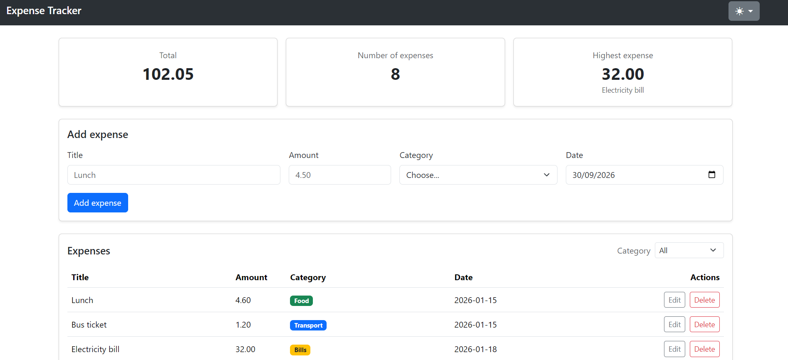
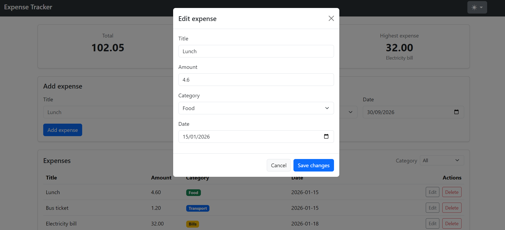
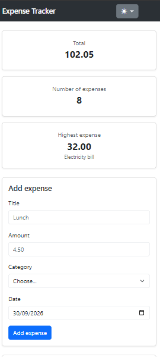

# Expense Tracker

A full-stack web application that allows users to track their daily expenses, view summary statistics, and filter transactions by category. It features a responsive vanilla JavaScript frontend communicating with a Node.js/Express REST API and a PostgreSQL database.

## How to run

**Backend**

1. Open pgAdmin, create a new database named `expense_tracker`.
2. Open the Query Tool and execute the code inside `backend/schema.sql` to create the `expenses` table and insert initial data.
3. Open a terminal in the `backend` folder and run `npm install express cors pg dotenv` to download dependencies (Express, pg, cors, dotenv).
4. Create a `.env` file in the `backend` folder with your database credentials:
   DB_HOST=localhost
   DB_PORT=5432
   DB_USER=postgres
   DB_PASSWORD=your_password_here
   DB_NAME=expense_tracker
5. Start the server by running `node server.js` It will run on http://localhost:3000.

**Frontend**

1. Open the frontend folder in VS Code.
2. Right-click on index.html and select Open with Live Server.
3. The app will open in your default browser. Make sure your backend server is still running so the app can fetch the data.

## Features

- [x] Add an expense (with validation)
- [x] Delete an expense
- [x] Edit an expense
- [x] Filter by category
- [x] Summary cards (total, count, highest)
- [x] Data is saved in a PostgreSQL database

## Screenshots

## What was the hardest part?

The most challenging part was managing the frontend state and ensuring the UI remained perfectly synchronized with the backend database. Implementing event delegation for the dynamically generated edit and delete buttons required careful handling of DOM events, and ensuring we always re-fetch the data from the server after any POST, PUT, or DELETE request instead of manually manipulating the HTML tables.

-Video Link:
https://drive.google.com/file/d/1DafRjS7p2R5kNWK7-BwmE2tHnr8uDOSZ/view?usp=sharing
